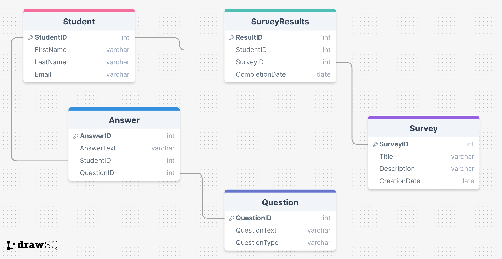

# ProjectSpring
# Functional Requirements

## Аутентифікація та реєстрація користувачів
- Система повинна дозволяти студентам реєструватися та входити до системи, використовуючи університетську електронну пошту.
- Система повинна аутентифікувати користувачів, щоб забезпечити доступ до анкет лише авторизованим студентам.

## Створення та управління анкетами
- Система повинна дозволяти уповноваженим користувачам (наприклад, адміністраторам або викладачам) створювати нові анкети, включаючи додавання, редагування та видалення запитань.
- Анкети повинні містити метадані, такі як назва, опис і дата створення.

## Типи запитань та відповіді
- Система повинна підтримувати різні типи запитань: відкриті, закриті та множинний вибір.
- Система повинна дозволяти студентам подавати відповіді на запитання анкет.

## Участь у анкетуванні
- Система повинна дозволяти студентам брати участь у анкетах, призначених для них.
- Система повинна відстежувати, які студенти завершили які анкети.

## Збір та аналіз відповідей
- Система повинна збирати та зберігати відповіді студентів на кожну анкету.
- Система повинна надавати інструменти для аналізу результатів анкетування, включаючи агрегування відповідей та створення звітів.

## Забезпечення безпеки та конфіденційності даних
- Система повинна забезпечувати конфіденційність та цілісність даних студентів.
- Система повинна відповідати вимогам чинних нормативних актів щодо захисту даних (наприклад, GDPR).

## Зручність використання та доступність
- Система повинна бути зручною у використанні та доступною для всіх студентів, включаючи осіб з обмеженими можливостями.
- Система повинна бути сумісною з різними пристроями (наприклад, комп'ютерами, планшетами, смартфонами).

## Повідомлення та нагадування
- Система повинна відправляти студентам повідомлення та нагадування про необхідність заповнення анкет.
- Повідомлення можуть бути відправлені електронною поштою або через інші доступні канали зв'язку.

## Пошук та фільтрація анкет
- Система повинна дозволяти користувачам шукати та фільтрувати анкети за різними критеріями (наприклад, назва, дата створення, статус завершення).

## Звітування та експорт даних
- Система повинна надавати можливість генерувати звіти на основі зібраних даних.
- Система повинна дозволяти експорт даних у різних форматах (наприклад, CSV, PDF) для подальшого аналізу.

# System Behaviours 

1. **"User Registration and Login" / "Реєстрація та вхід користувачів"**:
   - Студент реєструється в системі, використовуючи свою університетську електронну пошту та створюючи пароль.
   - Студент входить до системи, використовуючи свою електронну пошту та пароль.
   - Система перевіряє достовірність даних та надає доступ до системи у разі успішної аутентифікації.

2. **"Survey Creation" / "Створення анкети"**:
   - Адміністратор або викладач створює нову анкету, вводячи назву, опис та дату створення.
   - Адміністратор або викладач додає запитання до анкети, вибираючи тип запитання (відкрите, закрите, множинний вибір) та вводячи текст запитання.
   - Система зберігає нову анкету та її запитання в базі даних.

3. **"Survey Assignment" / "Призначення анкети"**:
   - Адміністратор або викладач призначає анкету певним студентам або групам студентів.
   - Система повідомляє студентів про нову анкету через електронну пошту або інші канали зв'язку.

4. **"Survey Participation" / "Участь у анкетуванні"**:
   - Студент відкриває призначену анкету та відповідає на запитання.
   - Студент подає відповіді на анкету, завершивши її.
   - Система зберігає відповіді студента в базі даних.

5. **"Survey Completion Tracking" / "Відстеження завершення анкетування"**:
   - Система відстежує статус завершення анкет для кожного студента.
   - Система оновлює статус анкети як завершений, коли студент подає всі відповіді.

6. **"Response Analysis" / "Аналіз відповідей"**:
   - Адміністратор або викладач переглядає зібрані відповіді на анкету.
   - Система надає інструменти для аналізу даних, включаючи агрегування відповідей та створення звітів.

7. **"Data Export" / "Експорт даних"**:
   - Адміністратор або викладач експортує дані анкетування у різних форматах (наприклад, CSV, PDF).
   - Система генерує файл з даними та надає можливість його завантаження.

8. **"Notifications and Reminders" / "Повідомлення та нагадування"**:
   - Система автоматично відправляє студентам нагадування про заповнення анкет, якщо встановлений дедлайн наближається.
   - Система надсилає підтвердження про успішне завершення анкетування після подання відповідей.

9. **"User Profile Management" / "Управління профілем користувача"**:
   - Студент може редагувати свій профіль, змінювати контактні дані та пароль.
   - Система зберігає зміни та оновлює інформацію про студента в базі даних.

10. **"Security and Data Privacy" / "Безпека та конфіденційність даних"**:
    - Система забезпечує захист даних студентів шляхом використання шифрування та інших методів безпеки.
    - Система обмежує доступ до даних лише авторизованим користувачам відповідно до їхніх ролей.

# REST API анкетування в університеті для студентів

#### "Реєстрація та вхід користувачів" / "User Registration and Login"

1. **"Реєстрація користувача" / "Register User"**
   - **Метод**: POST
   - **Ендпоінт**: /api/users/register
   - **Тіло запиту**:
     ```
     {
       "firstName": "string",
       "lastName": "string",
       "email": "string",
       "password": "string"
     }
     ```
   - **Відповідь**:
     ```
     {
       "userId": "int",
       "message": "string"
     }
     ```

2. **"Вхід користувача" / "Login User"**
   - **Метод**: POST
   - **Ендпоінт**: /api/users/login
   - **Тіло запиту**:
     ```
     {
       "email": "string",
       "password": "string"
     }
     ```
   - **Відповідь**:
     ```
     {
       "token": "string",
       "message": "string"
     }
     ```

#### "Управління анкетами" / "Survey Management"

3. **"Створення анкети" / "Create Survey"**
   - **Метод**: POST
   - **Ендпоінт**: /api/surveys
   - **Тіло запиту**:
     ```
     {
       "title": "string",
       "description": "string"
     }
     ```
   - **Відповідь**:
     ```
     {
       "surveyId": "int",
       "message": "string"
     }
     ```

4. **"Додати запитання до анкети" / "Add Question to Survey"**
   - **Метод**: POST
   - **Ендпоінт**: /api/surveys/{surveyId}/questions
   - **Тіло запиту**:
     ```
     {
       "questionText": "string",
       "questionType": "string"
     }
     ```
   - **Відповідь**:
     ```
     {
      

 "questionId": "int",
       "message": "string"
     }
     ```

5. **"Призначення анкети студентам" / "Assign Survey to Students"**
   - **Метод**: POST
   - **Ендпоінт**: /api/surveys/{surveyId}/assign
   - **Тіло запиту**:
     ```
     {
       "studentIds": ["int"]
     }
     ```
   - **Відповідь**:
     ```
     {
       "message": "string"
     }
     ```

#### "Участь у анкетуванні" / "Survey Participation"

6. **"Отримати анкету для студента" / "Get Survey for Student"**
   - **Метод**: GET
   - **Ендпоінт**: /api/students/{studentId}/surveys
   - **Відповідь**:
     ```
     {
       "surveys": [
         {
           "surveyId": "int",
           "title": "string",
           "description": "string"
         }
       ]
     }
     ```

7. **"Надіслати відповіді на анкету" / "Submit Survey Responses"**
   - **Метод**: POST
   - **Ендпоінт**: /api/students/{studentId}/surveys/{surveyId}/responses
   - **Тіло запиту**:
     ```
     {
       "responses": [
         {
           "questionId": "int",
           "answerText": "string"
         }
       ]
     }
     ```
   - **Відповідь**:
     ```
     {
       "message": "string"
     }
     ```

#### "Аналіз відповідей та експорт" / "Response Analysis and Export"

8. **"Отримати результати анкетування" / "Get Survey Results"**
   - **Метод**: GET
   - **Ендпоінт**: /api/surveys/{surveyId}/results
   - **Відповідь**:
     ```
     {
       "results": [
         {
           "studentId": "int",
           "answers": [
             {
               "questionId": "int",
               "answerText": "string"
             }
           ]
         }
       ]
     }
     ```

9. **"Експорт даних анкети" / "Export Survey Data"**
   - **Метод**: GET
   - **Ендпоінт**: /api/surveys/{surveyId}/export
   - **Відповідь**: (Завантаження файлу)

#### "Повідомлення та нагадування" / "Notifications and Reminders"

10. **"Відправити нагадування" / "Send Reminder"**
    - **Метод**: POST
    - **Ендпоінт**: /api/notifications/reminder
    - **Тіло запиту**:
      ```
      {
        "studentId": "int",
        "surveyId": "int",
        "message": "string"
      }
      ```
    - **Відповідь**:
      ```
      {
        "message": "string"
      }
      ```

## ER DIAGRAM


